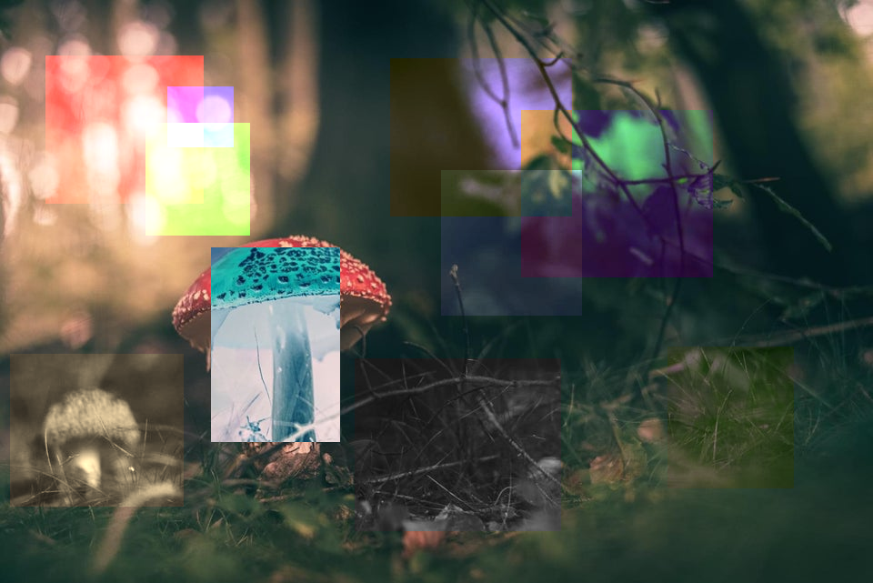
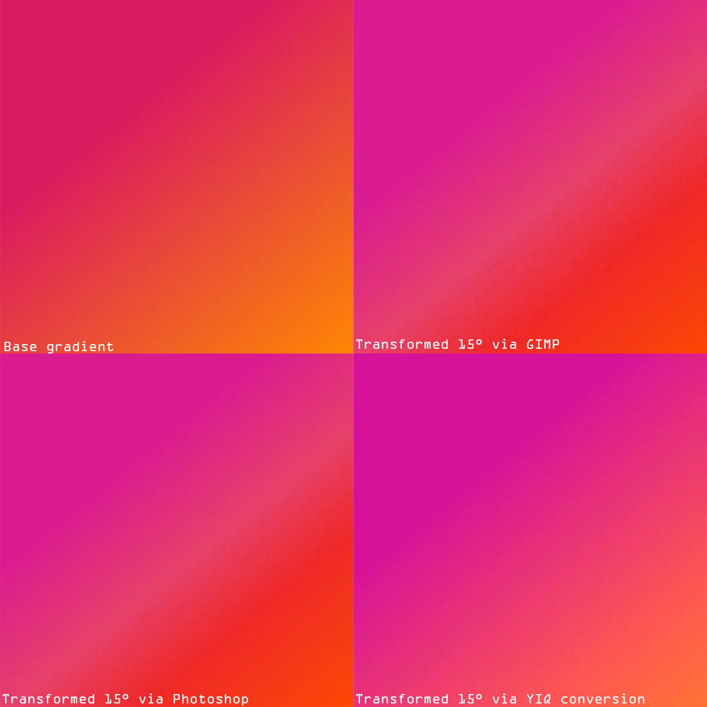

# Color-Filters-Gimp-Plugin

### GIMP - Změna barevných kanálů
* Semestrální práce zaměřená na téma úpravy barevných kanálů. Plugin je schopen měnit barvy ve vybrané oblasti v rámci barevného modelu RGB tak zároveň simulovat zacházení s barvami v modelu HSV.

* Přesnost operace barevné transformace v modelu HSV jsem porovnal s podobnými nástroji v photoshopu a gimpu.

* Dokumentace k práci najdete [zde](dokumentace.adoc)
