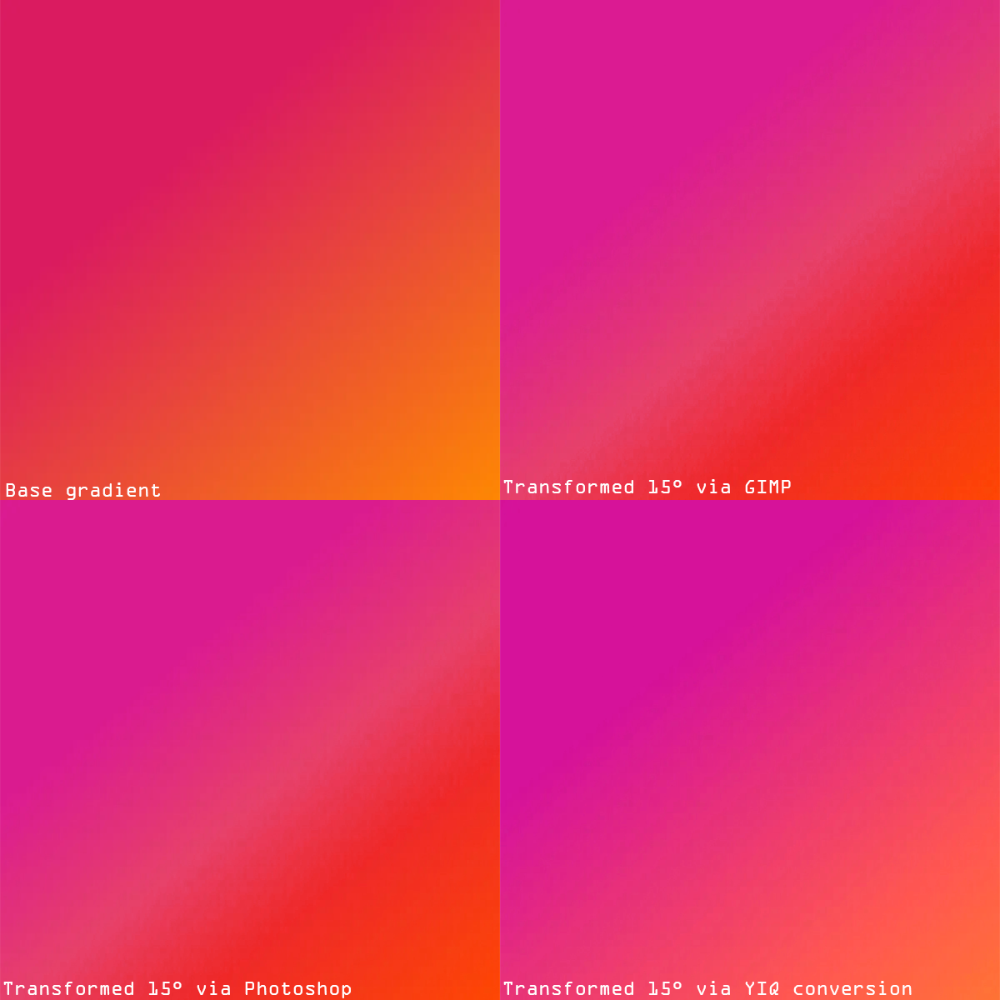

:toc:

= Custom color filter

# Specifikace pluginu

* *Autor*: Adam Polívka (polivad1@fit.cvut.cz)
* Plugin poskytující spoustu filtrů pro úpravu barevných kanálů. 
* Od převodu do černobílého obrázku, po úpravu barev ve formatu *RGB* a *HSV*. 
* Plugin je napsán v pythonu.
* Funguje jak pro celý obrázek, tak pro konkrétní výběr.
* *Úprava barev obrazku dle barvevných modelů*:
    ** `RGB` - _úprava barvy obrázku v barvovém modelu RGB (red-green-blue)_
    ** `HSV` - _úprava barvy obrázku v barvovém modelu HSV (hue-saturation-value)_
* *Další přednastavené filtry*:
    ** `Grayscale` - _převod obrázku na černobílý_
    ** `Sephia` - _uprava obrázku na sépii_
    ** `Invert colors` - _převrácení barev obrazku_
* *Merge Layers*:
    ** `Yes` - _aplikuje bavevný filtr a poté sloučí výsledné vrstvy do jedné_
    ** `No` - _vytvoří novou vrstvu, obsahující změny aplikované zvoleným filtrem_

# Plugin ke stažení

xref:color_filter.py#[color_filter.py]

# Ukázka pluginu

image:img/mushroom.png[ukazka prace programu]

# Instalace

## Windows
* Stáhněte si plugin do vašeho zařízení pomocí linku. Až se vám soubor stáhne, uložte si ho do složky odkud si ho GIMP při spouštění automaticky načte. Pro defaultní instalaci GIMPu pro Windows jsou výchozí složky a *C:\Program Files\GIMP 2\lib\gimp\2.0\plug-ins* a *C:\Users\USERNAME\AppData\Roaming\GIMP\2.10\plug-ins*.
* Pokud se vám plugin nenačte zkontrolujte záložku Plug-Ins v GIMPu ```Edit -> Preferences -> Folders -> Plug-ins```. Případně, pokud chcete mít pluginy uložené v jiné složce, stačí ji pouze přidat do seznamu.


* Nyní by se vám měla v GIMPu objevit záložka *Custom* a v ní *Custom Color Filter*.

## Linux

* Stáhněte si plugin do vašeho zařízení pomocí linku. Až se vám soubor stáhne, uložte si ho do složky odkud si ho GIMP při spouštění automaticky načte. Pro defaultní instalaci GIMPu pro Linux jsou výchozí složky a */home/lib/gimp/2.0/plug-ins* a */home/username/gimp/2.10/plug-ins*.
* Aby mohl plugin správně fungovat, je třeba mu přidělit práva na spuštění. Uživatel tak udělá pomocí ```chmod +x color_filter.py``` v terminálu.
* Pokud se vám plugin nenačte zkontrolujte záložku Plug-Ins v GIMPu ```Edit -> Preferences -> Folders -> Plug-ins```. Případně, pokud chcete mít pluginy uložené v jiné složce, stačí ji pouze přidat do seznamu.


* Nyní by se vám měla v GIMPu objevit záložka *Custom* a v ní *Custom Color Filter*.

# Technická dokumentace

## UI
* Uživatelské rozhraní programu je velmi jednoduché, nebylo tedy potřeba využití komplikovanějších nástrojů pro jeho vytvoření.
* UI je tvořeno pomocí metody *register*, do které stačí poslat parametry a GIMP automaticky vygeneruje uživatelské rozhraní v závislosti na zadaných parametrech.
* Rozhraní je rozděleno do tří částí.
** Výběr typu filtru, který bude program provádět:
*** `RGB transformace`
*** `HSV tranformace`
*** `Přednastavené filtry`
** Bližší nastavení zolené skupiny:
*** `RGB transformace` - _intenzita zvýšení hodnoty jednolivých kanálů_
*** `HSV transformace` - _intenzita zvýšení hodnoty jednolivých kanálů_
*** `Přednastavené filtry` -  _výběr mezi grayscale, invertování barev, sépií_
** Volba pro spojení všech vrstev do jedné.

* Uživatel si vždy může vybrat pouze jeden typ filtru(volba v prní částiů UI), který bude program aplikovat. Nastavení pro ostatní filtry, které nebyli zvoleny budou program ignoruje.

* Sekce výběr filtru je implementována pomocí *radio button* `PF_RADIO` kde uživatel zvolí jednu z nabízených možností. Volba bude zaznamenána do proměnné `filter`,
 kterou si main programu převezme, zpracuje a přizpůsobí jí svůj běh.

[source, python]
----
(PF_RADIO, "filter", "Filter:", "rgb",
    (
        ("RGB", "rgb"),
        ("HSV", "hsv"),
        ("Predefined filters", "ad"),
    )    
),
----

* Bliží nastavení filtru pro úpravy RGB a HSV transformací je použit *slider* `PF_SLIDER`. Každý kanál má svůj dedikovaný slider.
 Ve výsledku tedy 6 sliderů (```red/green/blue``` a ```hue/saturation/value```)
** Pro *RGB* transformace je rozsah sliderů -255 až 255 s defaultní hodnotou 0.
** U *HSV* tranformací má slider pro `hue` rozsah -180 až 180 a pro `saturaci` i `value` -100 až 100. Všechny tři slidery mají defaultní hodnotu 0.

* Ukázka implementace sliderů pro RGB transformaci.
[source, python]
----
(PF_SLIDER, "filter_level_r", "add Red:", 0, (-255, 255, 10)),
(PF_SLIDER, "filter_level_g", "add Green:", 0, (-255, 255, 10)),
(PF_SLIDER, "filter_level_b", "add Blue:", 0, (-255, 255, 10)),
----

* Při zvolení volby "přednastavené filtry" v první části UI si v druhé části budete moci vybrat ze skupiny přednastavených filtrů.
 Tento výběr je implementován pomocí *radio button* `PF_RADIO`.

[source, python]
----
(PF_RADIO, "filter_predefined", "Predefined filters:", "gs",
    (
        ("Grayscale", "gs"),
        ("Invert colors", "inv"),
        ("Sephia", "sep"),
    )    
),
----

* V třetí sekci je pomocí *bool button* `PF_BOOL` implementována volba na spojení vrstev do jedné. Volba uživatele se uloží do proměnné `flatten`,
 kterou si main programu převezme, zpracuje a přizpůsobí jí svůj běh.

* Výsledné UI


## Undo group
* Aby bylo možné vrátit kroky pluginu o jeden zpět pomocí zavolání *undo* v GIMPu (```ctrl + z```), kód hlavní funkce (`main`) je obalen do *undo groupy*
[source, python]
----
#start Undo group
pdb.gimp_image_undo_group_start(image)

.
.
# process image, apply filters, save image
.
.

# end Undo group
pdb.gimp_image_undo_group_end(image)
----

## Načtení obrázku
* Nejprve plugin zjistí zda se jedná o obrázek typu GRAY, RGB nebo RGBA. Díky této informaci určí hodnotu *BPP* (bytes per pixel).
* Dále spočítame souřadnice a velikost výběru.
* Pixely z vybrané sekce načteme do pole.

[source, python]
----
# loads number of bytes per pixel
# its value depends on whether the image is Grayscale* or RGB*
bpp = drawable.bpp
# load boundries 
(bx1, by1, bx2, by2) = drawable.mask_bounds
# calculate width and height
bw = bx2 - bx1
bh = by2 - by1
# input layer offset
(ox, oy) = drawable.offsets

# gets image data as a string containing byte array with source image data
src_rgn = drawable.get_pixel_rgn(bx1, by1, bw, bh, False, False)
# unpack image pixel data into arrays 
src_pixels = array.array("B", src_rgn[bx1:bx2, by1:by2])
----

## Nová vrstva
* Vytvoříme novou vrstvu pojmenovanou dle použitého filtru a přesuneme ji na správnou pozici.
* Výchozí vrstva bude vždy ve formátu *RGBA* pro usnadnění aplikace jednotlivých filtrů. 
* Vytvořená výchozí vrsta je přidána do projektu.

[source, python]
----
# changes the name of the new layer to proper one depending on the filter chosen
name = name_filter_layer(filter, filter_predefined)
# creates new layer with proper name
layer = gimp.Layer(image, name, bw, bh, RGBA_IMAGE, 100, NORMAL_MODE)
# adjust new layer position to fit the selected area
layer.set_offsets(bx1 + ox, by1 + oy)
# output image data
dst_rgn = layer.get_pixel_rgn(0, 0, bw, bh, True, True)
# all output pixels to arrays
dst_pixels = array.array("B", dst_rgn[0:bw, 0:bh])

# output layer is always RGBA for easier work later 
dst_bpp = 4

# add new layer to the project
image.add_layer(layer, 0)
----

## Aplikace filtrů
* Před spuštení upravy obrázku inicializujeme *Progress bar*, který uživatele informuje, jak daleko v procesu aplikce zvoleného filtru se nechází.
* Pomocí dvou cyklů procházíme pole obsahující informace o pixelech načteného obrázku. Formát pole záleží na hodnotě *BPP* načteného obrázku. Například:
** *BPP = 3* má pole charakter typu `RGBRGBRGB...`
** *BPP = 4* má pole charakter typu `RGBARGBARGBA...`
* Z pole načteme data pro jeden pixel a pomocí funkce `gimpcolor.RGB` si vytvoříme struktůru, se kterou se snadno bude manipulovat při aplikaci filtru na pixel. Tato struktůra má formát `rgb[0]` je červený kanál, `rgb[1]` zelený kanál, `rgb[2]` modrý kanál a `rgb[3]` alfa kanál, který v případě, že nebyl obsažen v načteném obrazků, je nastaven na hodnotu 255.
* Zavolání funkce, která aplikuje vybraný filtr na pixel.
* Uložení upraveného pixelu do výstupového bytového pole.
* Po zpracévaní řádku pixelů posuneme progress barem.


[source, python]
----
for y in range (0, bh):
    for x in range(0, bw):
        pos = (y * bw + x) * bpp

        data = src_pixels[pos:(pos + bpp)]
        # creates a simulation of RGB struct which contains each RGB channel
        # if alfa is not set, its automatically set to 255(100%)
        rgb = gimpcolor.RGB(data[0], data[1], data[2], data[3] if bpp == 4 else 255)

        # RGB color image filter 
        if filter == "rgb":
            filter_adjust_color_rgb(rgb, filter_level_r, filter_level_g, filter_level_b)

        # HSV color image filter
        if filter == "hsv":
            filter_adjust_color_hsv(rgb, filter_level_hue, filter_level_sat, filter_level_val)

        # Predefined filters
        if filter == "ad":
            # Grayscale image filter
            if filter_predefined == "gs":  
                filter_grayscale(rgb)   
            # Invert color image filter    
            elif filter_predefined == "inv":
                filter_invert_colors(rgb)
            # Sephia  image filter
            elif filter_predefined == "sep":
                filter_sephia(rgb)
                
        # converts our custom RGB struct into byte array
        data[0:dst_bpp] = array.array("B", rgb[0:dst_bpp])
        dst_pos = (x + bw * y) * dst_bpp
        # write filtered pixel data into the output byte array
        dst_pixels[dst_pos:(dst_pos + dst_bpp)] = data

    # update progress bar
    gimp.progress_update(float(y + 1) / bh)
----

## Jednotlivé barevné filtry

### Úprava v barevném modelu RGB
* K jednotlivým barevným kanálům se přičte hodnota, kterou uživatel zadal. 
* Výsledné hodnoty jsou oříznuty na interval *(0, 255)*. Tedy v případě, že by výsledné číslo po sečtení bylo 260, zapíše se 255.
 V případě záporného čísla bude zapsána 0.

[source, python]
----
# Add value to selected color channel
def filter_adjust_color_rgb(rgb, filter_value_r, filter_value_g, filter_value_b):
    # adjust RED channel value
    rgb[0] = max(0, min(255, int(rgb[0] + filter_value_r)))
                        
    # adjust GREEN channel value
    rgb[1] = max(0, min(255, int(rgb[1] + filter_value_g)))

    # adjust BLUE channel value  
    rgb[2] = max(0, min(255, int(rgb[2] + filter_value_b)))
----

### Úprava v barevném modelu HSV
* Při manipulaci s pixely v programu je pixel reprezenován pomocí struktůry simulující jednotlivé kanály RGB.
 Pro jeho úpravu v braveném modelu HSV by bylo ideální převést reprezentaci barvy z modelu *RGB* do *HSV*.
 Tyto modely ovšem *není možné* na sebe *lineárně namapovat*, *nelze* tedy provést *afinní transformaci* mezi těmito dvěma modely.
 Tuto překážku lze z části obejít pomocí vynásobení RGB kanálů tranformační maticí,
 která napodobuje zacházení s barvami způsobem, jako kdyby byly v barevném modelu HSV.
* Uprava pixelu filtrem probíhá následovně:
** Filtr tedy dostane pixel v modelu *RGB* a aplikuje na nej transformační matici, pomocí které ho převede barvy do barevového modelu *YIQ*.
 Tento model umožňuje snadné provedení hue rotace.
** Aplikuje samotnou úpravu barvy dle parametrů zadaných uživatelem.
** Konvertuje reprezentaci barvy z *YIQ* zpět do *RGB*.

* Matice tranformace použita pro tento filtr vypadá následovně:
** `V` - _value_
** `S` - _saturation_
** `U` - _cos((hue*pi)/180)_
** `W` - _sin((hue*pi)/180)_


* Srovnání výsledku custom filtru, využití transformace pres YIQ, v porovnaní s vestavěnými filtry v GIMPu a Phothoshopu.



* Na ilustračním obrazku si čtenář může všimnout nedokonalosti vestavěných filtrů. Když jsou tyto filtry
 aplikovány na jednoduchý *gradient*, je snadné poznat, že charakter přechodu mezi barvami je *znehodnocen*.
 Výsledek aplikace vestavěného filtru vypadá, jako kdyby byl obrýzek rozdělen na dvě dominantní barvy a mezi
 těmi byl nejaký lehký přechod. Na druhé straně tranformace pomocí přechodu na barevný model *YIQ* charakter
 gradientu *zachová*.
* Proč vestavěné filtry dosahují takovýchto výsledků? V případě photoshopu je to způsobeno typem implenetace
 jeho filtru pro HSV úpravy. Ten *nepoužívá linearní transformace*. Místo nich je naimplementovaný *"intuitivní"* systém,
 kde od nejnižší hodnoty barevného kanálu vyhodnotí *saturaci* a pomocí poměru mezi dvěmi zbylími barevnými kanály
 vypočítá *úhel* na šestisložkovém barevném kolu(```red/green/cyan/blue/magenta```). Tento přístup sice umožní snadnou reprezentaci
 hue ve srovnání s RGB kanály, ale výsledky jeho aplikace fungují pouze na čisté *jednoduché* barvy. V případě aplikace
 filtru například na jednoduchý gradient je výsledek *neuspokojivý*.

[source, python]
----
# Changes Hue-Saturation-Value of pixels from the source image 
def filter_adjust_color_hsv(rgb, 
                            filter_level_hue,
                            filter_level_sat,
                            filter_level_val):

    # RGB values are transformed to YIQ color model
    # user selected tranformations are applied
    # YIQ values are transformed back to RGB representation and saved
    # for further explonation behind this math see technical documentation  

    vsu = filter_level_val * filter_level_sat * cos(filter_level_hue * math.pi / 180)
    vsw = filter_level_val * filter_level_sat * sin(filter_level_hue * math.pi / 180)
    
    red = (
            (0.299 * filter_level_val + 0.701 * vsu + 0.168 * vsw) * rgb[0] +
            (0.587 * filter_level_val - 0.587 * vsu + 0.330 * vsw) * rgb[1] +
            (0.114 * filter_level_val - 0.114 * vsu - 0.497 * vsw) * rgb[2]
        ) 

    green = (
            (0.299 * filter_level_val - 0.299 * vsu - 0.328 * vsw) * rgb[0] + 
            (0.587 * filter_level_val + 0.413 * vsu + 0.035 * vsw) * rgb[1] +
            (0.114 * filter_level_val - 0.114 * vsu + 0.292 * vsw) * rgb[2]
        )

    blue = (
            (0.299 * filter_level_val - 0.300 * vsu + 1.250 * vsw) * rgb[0] +
            (0.587 * filter_level_val - 0.588 * vsu - 1.050 * vsw) * rgb[1] +
            (0.114 * filter_level_val + 0.886 * vsu - 0.203 * vsw) * rgb[2]
        )

    # save new color values in RGB color model
    rgb[0] = int(red)
    rgb[1] = int(green)
    rgb[2] = int(blue)
----

### Grayscale
* Sečtení násobků jednotlivých barevných RGB kanálů s určenými konstantami a následné vydělení součtu číslem 255.
* Výsledek této operace je číslo, které jsou uloženy do všech tří barevných kanálů.

[source, python]
----
# Grayscale filter 
def filter_grayscale(rgb):

    # calculate grayscale values (RED * 0.2989 + GREEN * 0.597 + BLUE * 0.114) / 255
    sum = (rgb[0] * 0.2989 + rgb[1] * 0.587 + rgb[2] * 0.114) / 255

    # set calculated values 
    for i in range(0, 3):
        rgb[i] = sum
----

### Sephia
* Pro každý výstupní barevný kanál provede sečtení násobků jednotlivých barevných RGB kanálů s určenými konstantami.
* V případě, že výsledná hodnota přesáhne hranici 255, je nahrazena číslem 255.
* Uložení vypočtených hodnot k příslušným barevným kanálů. 

[source, python]
----
# Sephia color filter
def filter_sephia(rgb):
    # calculate sephia red channel values (RED * 0.393 + GREEN * 0.769 + BLUE * 0.189)
    sep_r = int(min(255, rgb[0] * 0.393 + rgb[1] * 0.769 + rgb[2] * 0.189))
    # calculate sephia blue channel values (RED * 0.349 + GREEN * 0.686 + BLUE * 0.168)
    sep_g = int(min(255, rgb[0] * 0.349 + rgb[1] * 0.686 + rgb[2] * 0.168))
    # calculate sephia gree channel values (RED * 0.272 + GREEN * 0.534 + BLUE * 0.131)
    sep_b = int(min(255, rgb[0] * 0.272 + rgb[1] * 0.534 + rgb[2] * 0.131))

    # set calculated values
    rgb[0] = sep_r
    rgb[1] = sep_g
    rgb[2] = sep_b
----

### Invertování barev
* Pro každý barevný kanál provede převrácení jeho hodnoty. 
* Nová hodnota jednotlivého barevného kanálu je vypočtena vzorcem `255 - nastávající hodnota určeného barevného kanálu`.

[source, python]
----
# Invert colors filter
def filter_invert_colors(rgb):
    for i in range(0, 3):
        rgb[i] = 255 - rgb[i]
----

## Výsledná vrstva
* Zapsání a uložení upravených pixelů do výstupní vrstvy. 
* Zavoláním `layer.update` proběhne refresh na výstupní vrstvě a aby mohly být zobrazeny na display.
* Pokud uživatel zvolil spojení výstupní vrstvy s vrstvou původní, vrstvy se spojí.

[source, python]
----
# pack output byte array into the string and save it into the output layer 
dst_rgn[0:bw, 0:bh] = dst_pixels.tostring()
# apply changes on the filter layer
layer.flush()
# apply selection mask
layer.merge_shadow(True)
# refresh filter layer
layer.update(0, 0, bw, bh)

# merges layers into one if true
if flatten:
    pdb.gimp_image_flatten(image)
----

# Zdroje
* Cvičení přemětu BI-PGA 
* http://beesbuzz.biz/code/16-hsv-color-transforms
